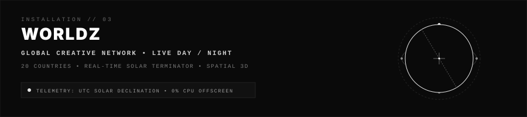

```text
SIVASURIYA

MULTIDISCIPLINARY
GRAPHIC DESIGNER /
VISUAL DESIGNER
```

```text
IDENTITY / IMAGE / TYPOGRAPHY / DIGITAL / MOTION / 3D
```

<p align="left">
  
</p>

```text
────────────────────────────────────────────────────────────────────────────────
INDEX

01   SELECTED WORK
02   DISCIPLINES
03   WORLDZ
04   ARCHIVE
05   EXPERIENCE
06   SERVICES
07   TOOLS
08   CONTACT
────────────────────────────────────────────────────────────────────────────────
```

## 00 — STATEMENT

> ### Design is not decoration. It is a structural enquiry into form, visual rhythm, and communicative tension.

Welcome to the digital studio archive of **SIVASURIYA** — an independent practice operating across brand identity, visual systems, editorial typography, digital interfaces, motion architecture, and spatial computing.

The work investigates the space between strict Swiss editorial discipline and unrestricted digital experimentation. Every artifact is constructed with typographic rigor, deliberate proportion, and tactile responsiveness.

```text
────────────────────────────────────────────────────────────────────────────────
```

## 01 — SELECTED WORK

```text
────────────────────────────────────────────────────────────────────────────────
CASE STUDY           DISCIPLINE             FOCUS
────────────────────────────────────────────────────────────────────────────────
ZESIS                Brand Identity         Visual System, Guidelines & Typography
EMYSC                Poster / Print         Editorial Architecture & Print Systems
MKEGG                Digital Design         Interface Architecture & Design Tokens
ARIMM                UI / UX                Spatial Composition & Interactive Media
────────────────────────────────────────────────────────────────────────────────
```

### ZESIS
**Brand Identity & Dynamic Visual Language**  
A comprehensive brand architecture conceived around typographic hierarchy, strict grid structures, and variable identity systems across digital and tactile environments.

### EMYSC
**Poster & Print Architecture**  
An editorial publication investigation exploring tactile print forms, experimental column systems, micro-typography, and high-contrast visual rhythm.

### MKEGG
**Digital Interface & Experience Architecture**  
Interactive product design combining bespoke design tokens, fluid layouts, tactile micro-interactions, and responsive editorial visual systems.

### ARIMM
**Experimental Media & UI / UX Research**  
Spatial composition and generative visual exploration exploring the intersection of modern interface architecture, motion, and digital art direction.

```text
────────────────────────────────────────────────────────────────────────────────
```

## 02 — DISCIPLINES

```text
DISCIPLINES

BRANDING
GRAPHIC DESIGN
POSTER / PRINT
DIGITAL DESIGN
UI / UX
MOTION
3D
IMAGE MAKING
ART DIRECTION
EXPERIMENTAL MEDIA
```

```text
────────────────────────────────────────────────────────────────────────────────
```

## 03 — WORLDZ

```text
WORLDZ

GLOBAL CREATIVE NETWORK
LIVE DAY / NIGHT
20 COUNTRIES
REAL-TIME SOLAR TERMINATOR
```

<p align="left">
  
</p>

An exhibition-scale spatial 3D WebGL installation visualizing 20 global creative network hubs across active timezones:

* **Solar Geometry**: Real-time day/night terminator calculated directly from UTC solar declination.
* **Geodesic Topology**: Great-circle orbital connection arcs with traveling signal pulses between creative hubs.
* **Autonomous Telemetry**: Live local clock ticks and daylight classification across 20 countries.
* **Resource Restraint**:
  * `IntersectionObserver` viewport pausing (0% CPU/GPU overhead when scrolled away).
  * Tab visibility listener (`visibilitychange`) halts rendering cycles when hidden.
  * Dedicated **Hard Mobile / iOS Safety Profile** capping DPR at 0.85 and frame-throttling to 28 FPS.
  * Graceful WebGL context loss and restoration lifecycle guards.

```text
────────────────────────────────────────────────────────────────────────────────
```

## 04 — ARCHIVE

```text
ARCHIVE // CURATED INVESTIGATIONS

[2026]   BRAND ARCHITECTURE               SYSTEM STUDY & IDENTITY TOKENS
[2026]   TYPOGRAPHIC EXPERIMENTS          DISPLAY SERIF & HIGH-CONTRAST GROTESQUE
[2025]   EDITORIAL PRINT SYSTEMS          TACTILE INVESTIGATION & PUBLICATION GRIDS
[2025]   SPATIAL 3D VOLUMES               PLANETARY MESHES & HARDWARE-ACCELERATED SHADERS
[2025]   DYNAMIC MOTION LOOPS             H.264 HARDWARE DECODING & TIMELINE COMPOSITION
[2024]   DIGITAL INTERFACE ARTIFACTS      INTERACTION DESIGN & ACCESSIBILITY MATRICES
[2024]   GENERATIVE VISUAL EXPLORATIONS   ALGORITHMIC COMPOSITION & EXPERIMENTAL MEDIA
```

```text
────────────────────────────────────────────────────────────────────────────────
```

## 05 — EXPERIENCE

```text
EXPERIENCE

2024—NOW
INDEPENDENT / FREELANCE
MULTIDISCIPLINARY GRAPHIC DESIGNER

2025
UI / UX DESIGN

2025
3D DESIGN

2025
VIDEO EDITING
```

```text
────────────────────────────────────────────────────────────────────────────────
```

## 06 — SERVICES

```text
SERVICES

IDENTITY
CAMPAIGNS
EDITORIAL
DIGITAL
INTERFACE
MOTION
3D
ART DIRECTION
```

```text
────────────────────────────────────────────────────────────────────────────────
```

## 07 — TOOLS

```text
TOOLS

DESIGN
Photoshop · Illustrator · Figma

MOTION
After Effects · Premiere Pro

3D
Blender · Three.js · WebGL

WEB
HTML · CSS · JavaScript

AI
Generative / Experimental
```

```text
────────────────────────────────────────────────────────────────────────────────
```

## 08 — PERFORMANCE

```text
PERFORMANCE // TECHNICAL SPECIFICATIONS

INITIAL PAYLOAD         4.05 MB
PRODUCTION 3D MODEL     3.37 MB  [ assets/3d/earth.glb ]
ASSETS > 10 MB          0
ASSETS > 25 MB          0
CONSOLE ERRORS          0
HORIZONTAL OVERFLOW     0
ACTIVE RAF LOOPS        1        [ THROTTLED TO DISPLAY / PROFILE ]
OFFSCREEN RENDERING     PAUSED   [ 0% GPU / CPU OVERHEAD ]
TEST SUITE              37 / 37 PASSED
```

```text
────────────────────────────────────────────────────────────────────────────────
```

## 09 — TECHNOLOGY

```text
CORE
HTML5 · CSS3 (Vanilla) · JavaScript (ES6+ Modular)

GRAPHICS & SPATIAL
Three.js · WebGL · HTML5 Canvas API · Compressed GLTF / GLB

ARCHITECTURE
Static Asset Delivery · Zero-Build Pipeline · Native Web Standards
```

```text
────────────────────────────────────────────────────────────────────────────────
```

## 10 — DEPLOYMENT

```text
DEPLOYMENT

CLOUDFLARE WORKERS
STATIC ASSETS
EDGE DELIVERY
AUTOMATED DEPLOYMENT
```

### Primary Production
* **Worker**: `sivax10s-portfoli0`
* **Configuration**: `wrangler.jsonc`
* **Production Endpoint**: **[https://sivax10s-portfoli0.sivasuriyamvsn.workers.dev](https://sivax10s-portfoli0.sivasuriyamvsn.workers.dev)**

### Global Mirror
* **Platform**: GitHub Pages
* **Branch**: `main`
* **Folder**: `/(root)`
* **Mirror Endpoint**: **[https://siva-1o.github.io/SIVAx10s_PORTFOLIO/](https://siva-1o.github.io/SIVAx10s_PORTFOLIO/)**

### Repository
* **Source**: **[https://github.com/SIVA-1O/SIVAx10s_PORTFOLIO](https://github.com/SIVA-1O/SIVAx10s_PORTFOLIO)**

```text
────────────────────────────────────────────────────────────────────────────────
```

## 11 — VISITORS

```text
────────────────────────────────────────────────────────────────────────────────

VISITORS // EXHIBITION AUDIT
```

<p align="left">
  <a href="https://github.com/SIVA-1O/SIVAx10s_PORTFOLIO">
    
  </a>
</p>

```text
────────────────────────────────────────────────────────────────────────────────
```

## 12 — CONTACT & COLOPHON

```text
LET'S
MAKE
SOMETHING
VISIBLE.
```

```text
AVAILABLE FOR SELECT COMMISSIONS
```

### Direct & Networks
* **Portfolio**: [https://sivax10s-portfoli0.sivasuriyamvsn.workers.dev](https://sivax10s-portfoli0.sivasuriyamvsn.workers.dev)
* **LinkedIn**: [https://www.linkedin.com/in/sivaX10S/](https://www.linkedin.com/in/sivaX10S/)
* **Behance**: [https://www.behance.net/sivax10s](https://www.behance.net/sivax10s)
* **GitHub**: [https://github.com/SIVA-1O](https://github.com/SIVA-1O)
* **X**: [https://x.com/SIVAx10s](https://x.com/SIVAx10s)

```text
────────────────────────────────────────────────────────────────────────────────
COLOPHON

TYPEFACES          INTER / GROTESQUE / MONOSPACE
COLOR SPACE        MONOCHROME [ #0A0A0A / #111111 / #888888 / #FFFFFF ]
GEOGRAPHY          CHENNAI, IN [ 13°05'N 80°16'E ]
STATUS             INDEPENDENT PRACTICE

© 2026 SIVASURIYA. ALL RIGHTS RESERVED.
────────────────────────────────────────────────────────────────────────────────
```
