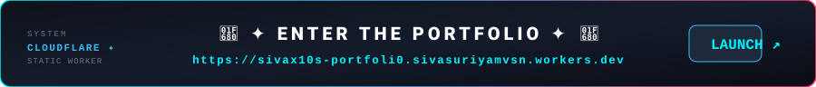
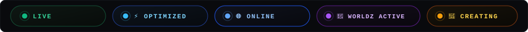
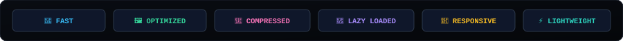
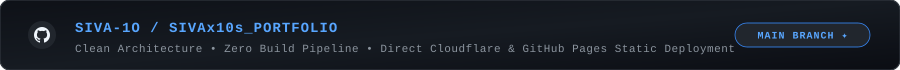

<p align="center">
  
</p>

<p align="center">
  <a href="https://sivax10s-portfoli0.sivasuriyamvsn.workers.dev">
    
  </a>
</p>

<p align="center">
  
</p>

---

# 🎨 SIVASURIYA

### ✦ Multidisciplinary Graphic Designer / Visual Designer

> **Visual systems • Brand identities • Digital experiences • Experimental design**

Welcome to **SIVASURIYA** — a curated multidisciplinary design portfolio exploring the intersection of **graphic design, visual identity, typography, digital interfaces, motion, 3D, and interactive experiences.** ✦

<p align="center">
  
</p>

<p align="center">
  
</p>

<p align="center">
  
</p>

## 🌐 WHAT'S INSIDE

🎯 **Brand Identity**  
🖋️ **Typography & Visual Systems**  
📰 **Poster & Print Design**  
💻 **Digital Design**  
🧩 **UI / UX Design**  
🎞️ **Motion & Visual Experiments**  
🌍 **Interactive 3D / WebGL**  
🖼️ **Image Making & Art Direction**  
🗂️ **Creative Archive & Experiments**  

This portfolio is built as a **visual playground** — combining structured design systems with experimental digital interactions.

<p align="center">
  
</p>

## 🎨 SELECTED WORK

<p align="center">
  
</p>

Four core featured projects showcasing cross-disciplinary visual thinking:

### ✦ ZESIS
* **Discipline**: Brand Identity & Visual System
* **Focus**: Comprehensive brand world, typographic guidelines, collateral design, and dynamic visual language.

### ✦ EMYSC
* **Discipline**: Editorial Design & Print Architecture
* **Focus**: Grid systems, publication layout, experimental typography, and tactile print aesthetics.

### ✦ MKEGG
* **Discipline**: Digital Interface & UI / UX Design
* **Focus**: Interactive digital product experience, design tokens, micro-interactions, and responsive design systems.

### ✦ ARIMM
* **Discipline**: Experimental Media & Visual Research
* **Focus**: Generative visuals, motion studies, spatial composition, and boundary-pushing digital art direction.

<p align="center">
  
</p>

## ⚡ EXPERIENCE THE PORTFOLIO

✨ **Interactive Visual Systems**  
Explore projects through an editorial-inspired interface designed around composition, typography, motion, and visual rhythm.

🌊 **Motion Background**  
A dynamic visual background system creates continuous movement throughout the experience with hardware-accelerated playback.

🔊 **Sound Experience**  
Subtle ambient audio interaction adds another sensory layer to the visual environment.

🌍 **WORLDZ — Interactive 3D**  
Explore an interactive **3D WebGL world experience** with an immersive spatial interface and real-time day/night terminator.

🖱️ **Micro-Interactions**  
Hover states, transitions, navigation interactions, scrolling effects, and subtle interface responses create a tactile editorial experience.

📄 **Interactive Resume & Dossier**  
Access the designer's credentials and experience directly through the portfolio experience.

📱 **Responsive Experience**  
Designed to adapt seamlessly across **desktop, tablet, and mobile** screens with zero horizontal overflow.

<p align="center">
  
</p>

## 🌍 WORLDZ — LIVE 3D GLOBAL NETWORK

<p align="center">
  
</p>

Section 03 introduces **WORLDZ**: an interactive 3D WebGL globe visualizing 20 global creative network hubs across timezones.

* 🌐 **20 Global Hubs**: Exact coordinates, real-time local clock calculation, and timezone monitoring.
* ☀️ **Solar Terminator**: Real-time day/night line calculated from UTC time and solar declination.
* 🛰️ **Great-Circle Routing**: Orbital connection arcs with traveling animated signal pulses.
* ⚡ **Performance & Safety**:
  - `IntersectionObserver` viewport pausing (0% CPU/GPU overhead when offscreen).
  - Tab visibility listening (`visibilitychange`) pauses rendering when the tab is hidden.
  - Dedicated **Hard Mobile / iOS Safety Profile** capping DPR at 0.85 and frame-throttling to 28 FPS.
  - Graceful WebGL context loss and restoration handling.

<p align="center">
  
</p>

## 📊 PERFORMANCE & ASSET OPTIMIZATION

<p align="center">
  
</p>

Built with strict performance limits ensuring instantaneous load times on any network or device:

* 🚀 **Asset Size Audit**:
  - Assets > 25 MiB: **0**
  - Assets > 10 MiB: **0**
  - Largest Web Asset: `3.42 MiB` (ambient sound)
  - Production 3D Model: `3.37 MiB` (`assets/3d/earth.glb`)
* 🧊 **Lazy Loading**: Three.js, OrbitControls, and 3D assets are deferred strictly until Section 03 approaches the viewport.
* 📱 **Verified Stability**: 37/37 automated headless browser tests passing across viewports from 320px (iPhone SE) to 1920px (FHD).

<p align="center">
  
</p>

## 🛠️ TECHNOLOGY

### 💻 Core Web Technologies
🔹 **HTML5** — Semantic structure, meta tags, and accessibility  
🔹 **CSS3 (Vanilla)** — Modern layout, custom properties, glassmorphism, responsive typography  
🔹 **JavaScript (ES6+)** — Modular architecture, custom state management, micro-interactions  

### 🧊 Interactive 3D & Graphics
🔹 **Three.js** — 3D scene graph, camera easing, spherical coordinates  
🔹 **WebGL** — Hardware-accelerated shader pipelines and mesh rendering  
🔹 **Canvas API** — Real-time visual canvas effects and dynamic drawing  
🔹 **GLTF / GLB** — Web-optimized compressed 3D models  

### 🎨 Creative Suite & Design Tools
✦ **Figma** — Interface design, design systems, interactive prototypes  
✦ **Adobe Photoshop** — Image making, compositing, visual asset creation  
✦ **Adobe Illustrator** — Vector typography, branding marks, iconography  
✦ **Adobe After Effects** — Motion design, kinetic typography, animation  
✦ **Adobe Premiere Pro** — Editorial video sequencing, sound design  
✦ **Blender** — 3D modeling, UV mapping, planetary lighting  
✦ **AI / Generative** — Generative visual exploration and prompt crafting  

<p align="center">
  
</p>

## 📁 PROJECT STRUCTURE

```text
SIVASURIYA/
│
├── 📂 assets/
│   ├── 🖼️ 3d/                 # Production WebGL GLB & webp fallback assets
│   ├── 🔊 audio/              # Ambient soundtrack (sound.mp3)
│   ├── 🎞️ background/         # Motion loop video & fallback posters
│   ├── 📄 documents/          # Resume / Dossier PDF
│   ├── 💼 freelance/          # Experience visual assets
│   ├── 🎨 projects/           # Case study images & assets
│   └── 🖼️ readme/             # Animated SVG assets for documentation
│
├── 📂 css/
│   ├── main.css               # Design tokens, variables & typography
│   ├── components.css         # UI components, cards, navigation
│   └── responsive.css         # Responsive breakpoints & viewport rules
│
├── 📂 js/
│   ├── app.js                 # Portfolio controller & lifecycle management
│   ├── data.js                # Project data, case studies & country hubs
│   ├── three-viewer.js        # WORLDZ Three.js / WebGL 3D Earth module
│   ├── interactive.js         # Editorial micro-interactions & cursor effects
│   ├── bg-player.js           # Motion background player controller
│   └── lightbox.js            # Modal viewer & project dossier logic
│
├── 🌐 index.html              # Main application markup & semantic layout
├── 🐍 server.py               # Local development server with no-cache MIME
├── ⚙️ wrangler.jsonc          # Cloudflare Workers static asset configuration
├── 🛡️ .assetsignore           # Cloudflare upload exclusions
├── 📝 README.md               # Visual portfolio documentation
└── 🖼️ favicon.ico             # Portfolio favicon
```

<p align="center">
  
</p>

## 🚀 DEPLOYMENT

### ☁️ Production Platforms

#### 1. Cloudflare Workers (Primary)
* **Status**: 🟢 LIVE
* **Worker Name**: `sivax10s-portfoli0`
* **Configuration**: [wrangler.jsonc](wrangler.jsonc)
* **Production URL**: **[https://sivax10s-portfoli0.sivasuriyamvsn.workers.dev](https://sivax10s-portfoli0.sivasuriyamvsn.workers.dev)**

```bash
# Deploy to Cloudflare Workers
npx wrangler deploy
```

#### 2. GitHub Pages (Mirror)
* **Status**: 🟢 ONLINE
* **Branch**: `main`
* **Folder**: `/(root)`
* **URL**: **[https://siva-1o.github.io/SIVAx10s_PORTFOLIO/](https://siva-1o.github.io/SIVAx10s_PORTFOLIO/)**

Designed as a lightweight static portfolio that deploys directly without complex build pipelines.

<p align="center">
  
</p>

## 🐙📦 GITHUB REPOSITORY

<p align="center">
  <a href="https://github.com/SIVA-1O/SIVAx10s_PORTFOLIO">
    
  </a>
</p>

### 🔗 Source Code
**[🚀 SIVA-1O/SIVAx10s_PORTFOLIO](https://github.com/SIVA-1O/SIVAx10s_PORTFOLIO)**

The repository contains the complete front-end source and creative assets used to build the portfolio.

<p align="center">
  
</p>

## 🛠️💻 RUN LOCALLY

### 1️⃣ Clone the repository

```bash
git clone https://github.com/SIVA-1O/SIVAx10s_PORTFOLIO.git
```

### 2️⃣ Enter the project directory

```bash
cd SIVAx10s_PORTFOLIO
```

### 3️⃣ Start the local development server

```bash
python server.py
# or
python -m http.server 3000
```

### 4️⃣ Open your browser

```text
🌐 http://localhost:3000
```

### 5️⃣ Explore
🎨 Browse the 4 featured case studies  
🖱️ Test micro-interactions and audio feedback  
🌍 Experience the interactive 3D WebGL Earth  
🎞️ View the ambient motion background system  
📱 Test responsive layouts across viewports  

<p align="center">
  
</p>

## 🎨 DESIGN LANGUAGE

The visual direction combines:

```text
╭────────────────────────────────────╮
│  TYPOGRAPHY       ✦                │
│  COMPOSITION      ✦                │
│  MOTION           ✦                │
│  IMAGE             ✦                │
│  INTERACTION       ✦                │
│  3D                ✦                │
│  EXPERIMENTATION   ✦                │
╰────────────────────────────────────╯
```

A **dark, editorial, experimental visual language** provides the foundation for the portfolio while allowing individual projects and disciplines to establish their own visual identity.

<p align="center">
  
</p>

## 🧠 CREATIVE APPROACH

> **Design is not limited to a single medium.**

The practice moves between:

**GRAPHIC → DIGITAL → MOTION → 3D → INTERACTION → EXPERIMENT**

Each project becomes an opportunity to explore a different combination of **form, typography, image, technology, movement, and visual communication.**

<p align="center">
  
</p>

## 🗂️ CREATIVE ARCHIVE

The portfolio also functions as an evolving archive of:

🎨 Visual experiments  
🧪 Design studies  
🔤 Typography explorations  
🖼️ Image-making experiments  
🎞️ Motion studies  
🌐 Digital interfaces  
🌍 3D experiments  
🤖 AI / generative explorations  

<p align="center">
  
</p>

## 📊 PORTFOLIO AT A GLANCE

| ✦   | Category                        | Discipline Overview |
| --- | ------------------------------- | ------------------- |
| 🎨  | **Multidisciplinary Visual Design** | Holistic visual systems & direction |
| 🏷️ | **Branding & Identity**         | Brand world, guidelines & marks |
| 🖋️ | **Typography**                  | Editorial layout, custom display & hierarchy |
| 📰  | **Poster & Print**              | Print architecture, publication & tactile forms |
| 💻  | **Digital Design**              | Web platforms, landing pages & digital identity |
| 🧩  | **UI / UX**                     | User experience, micro-interactions & systems |
| 🎞️ | **Motion Design**               | Kinetic typography, video & rhythm |
| 🌍  | **Interactive 3D**              | Three.js, WebGL & spatial interfaces |
| 🖼️ | **Image Making**                | Art direction, photo manipulation & imagery |
| 🎯  | **Art Direction**               | Visual narrative, concept & creative strategy |
| 🧪  | **Experimental Media**          | Generative visuals, code experiments & research |

<p align="center">
  
</p>

## 🔗 CONNECT & SOCIAL

Let's collaborate or connect across platforms:

* 🌐 **Portfolio**: [https://sivax10s-portfoli0.sivasuriyamvsn.workers.dev](https://sivax10s-portfoli0.sivasuriyamvsn.workers.dev/)
* 💼 **LinkedIn**: [https://www.linkedin.com/in/sivaX10S/](https://www.linkedin.com/in/sivaX10S/)
* 🎨 **Behance**: [https://www.behance.net/sivax10s](https://www.behance.net/sivax10s)
* 🐙 **GitHub**: [https://github.com/SIVA-1O](https://github.com/SIVA-1O)
* 𝕏 **X (Twitter)**: [https://x.com/SIVAx10s](https://x.com/SIVAx10s)

<p align="center">
  
</p>

## ⭐ PROJECT PHILOSOPHY

```text
OBSERVE
   ↓
EXPLORE
   ↓
DESIGN
   ↓
EXPERIMENT
   ↓
INTERACT
   ↓
REFINE
   ↓
REPEAT ↻
```

The portfolio is continuously evolving as new projects, experiments, visual systems, and interactive experiences are developed.

---

### 🖤 SIVASURIYA

**Graphic Design • Visual Design • Digital • Motion • 3D • Experimental**

`© 2026 SIVASURIYA. All Rights Reserved.`
